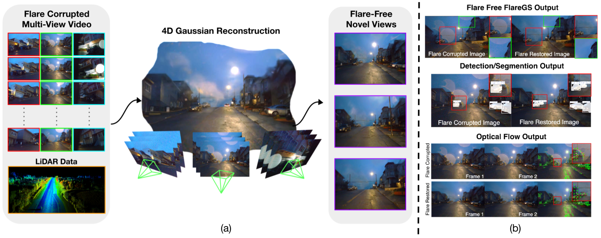
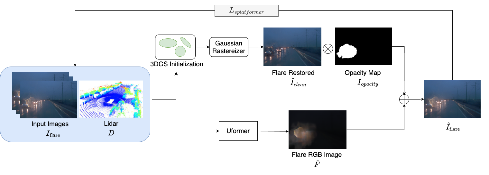
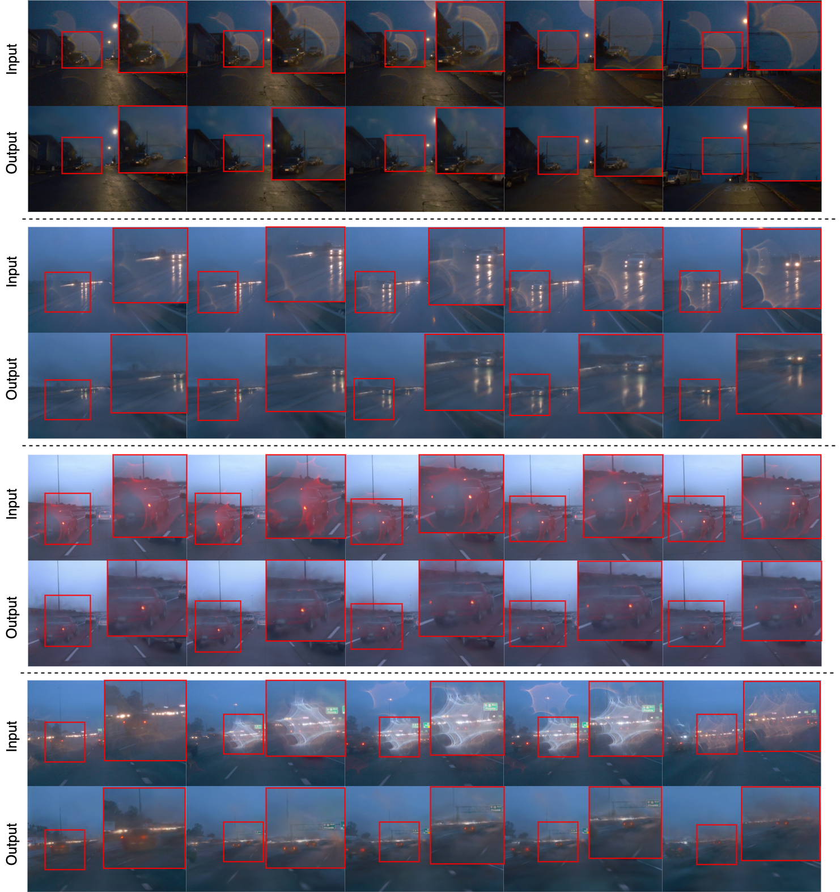
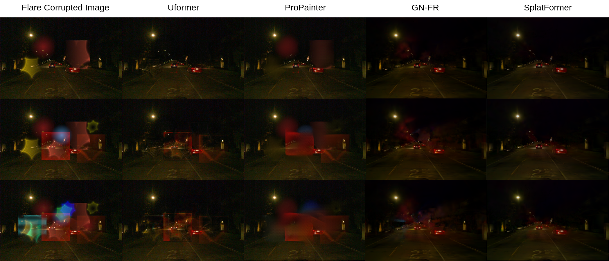
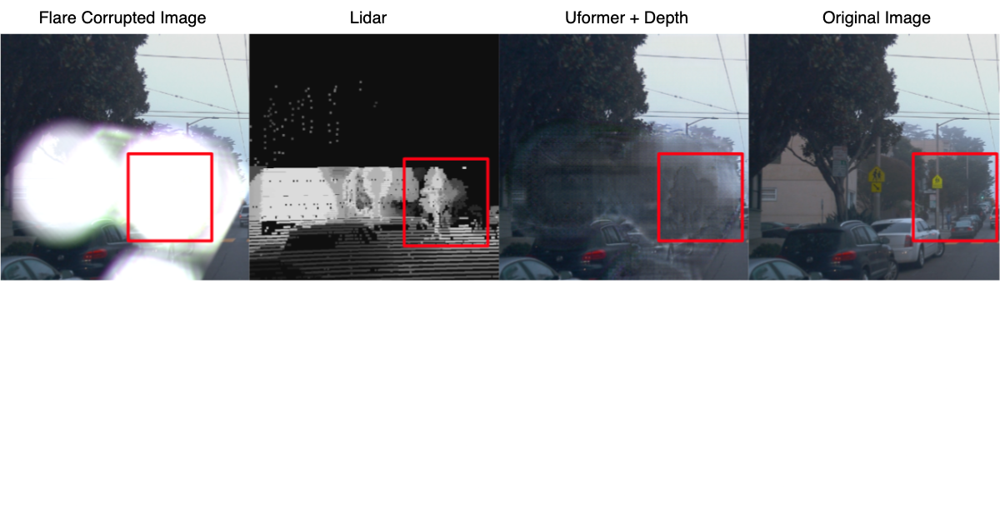
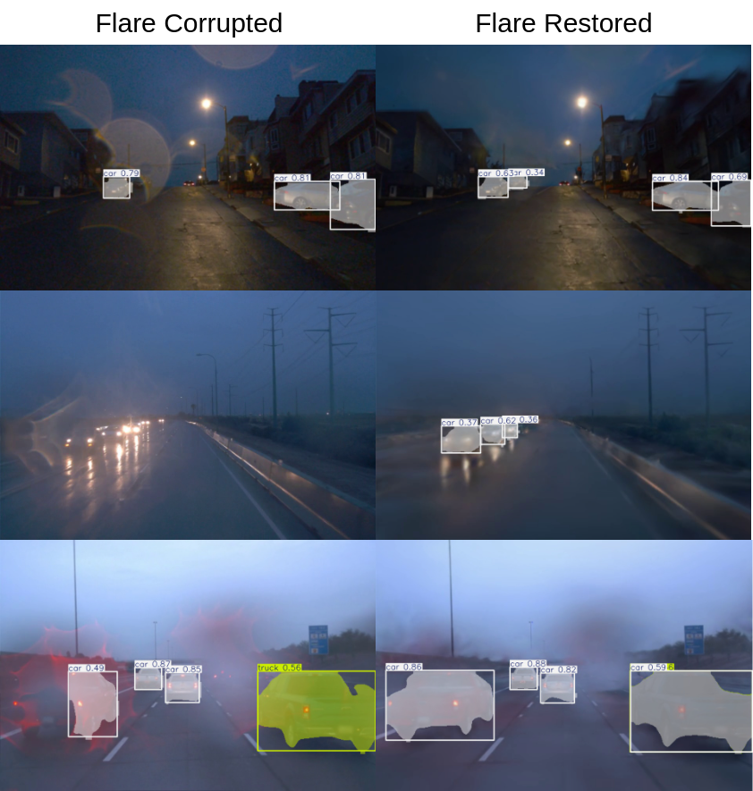

# 🌟 FlareGS: 4D Flare Removal using Gaussian Splatting for Urban Scenes

[](https://openaccess.thecvf.com/ICCV2025)
[](https://arxiv.org/)
[](LICENSE)

<div align="center">
  
  <p><em>Our approach addresses 4D flare removal by utilizing multi-view information through Gaussian splatting. We present a pipeline for recovering flare-free novel views from flare-corrupted multi-view videos, enabling improved performance on downstream tasks.</em></p>
</div>

## 📖 Abstract

Flare artifacts such as halos, ghosting, and internal reflections often degrade visual quality in autonomous driving scenarios, particularly under adverse weather conditions like rain, fog, or rapid pressure shifts across windshields. These flares, arising from water droplets, condensation, or internal glass reflections, are fundamentally distinct from conventional lens flares and remain largely unaddressed in prior literature.

In this work, we present the first systematic effort to model and remove such reflective flares that appear in real-world driving videos. Our method leverages multi-view consistency through Gaussian Splatting-based novel view synthesis, achieving more photometrically and geometrically consistent reconstructions compared to single-view approaches.

## 🎯 Key Contributions

- **🌊 Physics-based Synthetic Pipeline**: We introduce a controlled synthetic dataset that simulates flare formation using physics-informed rendering
- **🔍 Depth-guided Uformer Architecture**: A multi-modal restoration framework that fuses flare-degraded RGB inputs with flare-invariant depth priors
- **🎨 Gaussian Splatting Framework**: Novel view synthesis that enhances multi-view consistency and facilitates accurate reconstruction of flare-free scenes
- **📊 Comprehensive Evaluation**: Significant improvements in both visual fidelity and downstream tasks (segmentation, optical flow) under adverse weather conditions

## 🏗️ Method Overview

<div align="center">
  
  <p><em>Our depth-guided Uformer architecture leverages depth information to better disentangle flare artifacts from scene content.</em></p>
</div>

## 🎨 Qualitative Results

<div align="center">
  
  <p><em>Visual comparison of flare removal results across different methods and scenarios.</em></p>
</div>

## 📊 Model Comparison

<div align="center">
  
  <p><em>Quantitative comparison with state-of-the-art methods on flare removal and downstream tasks.</em></p>
</div>

## 🔬 Ablation Studies

<div align="center">
  
  <p><em>Ablation study demonstrating the effectiveness of different components in our framework.</em></p>
</div>

<div align="center">
  
  <p><em>Additional ablation results showing the impact of depth guidance and multi-view synthesis.</em></p>
</div>

## 🎯 Downstream Task Performance

<div align="center">
  
  <p><em>Improved semantic segmentation performance after flare removal using our method.</em></p>
</div>

## 🎭 Synthetic Dataset

<div align="center">
  
  <p><em>Our physics-based synthetic dataset generation pipeline for realistic flare simulation.</em></p>
</div>

## 🚗 Real-world Driving Scenarios

<div align="center">
  
  <p><em>Flare removal results on real-world driving scenarios with various weather conditions.</em></p>
</div>

## 📚 Citation

If you find this work useful for your research, please cite our paper:

```bibtex
@inproceedings{flaregs2025,
  title={FlareGS: 4D Flare Removal using Gaussian Splatting for Urban Scenes},
  author={[Author Names]},
  booktitle={Proceedings of the IEEE/CVF International Conference on Computer Vision (ICCV)},
  year={2025}
}
```

## 🤝 Acknowledgments

We thank the ICCV 2025 reviewers for their valuable feedback. This work was supported by [Institution Names].

## 📄 License

This project is licensed under the MIT License - see the [LICENSE](LICENSE) file for details.

---

<div align="center">
  <p><strong>🌟 Star this repository if you find it helpful!</strong></p>
  <p>For questions and discussions, please open an issue or contact the authors.</p>
</div> 